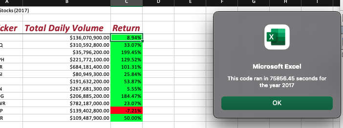
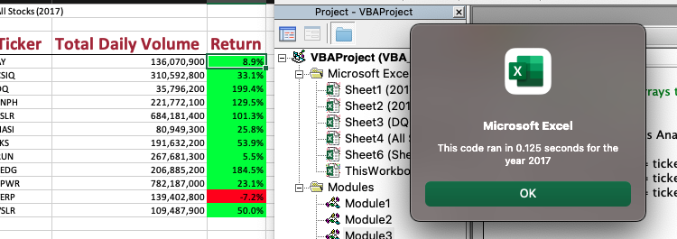
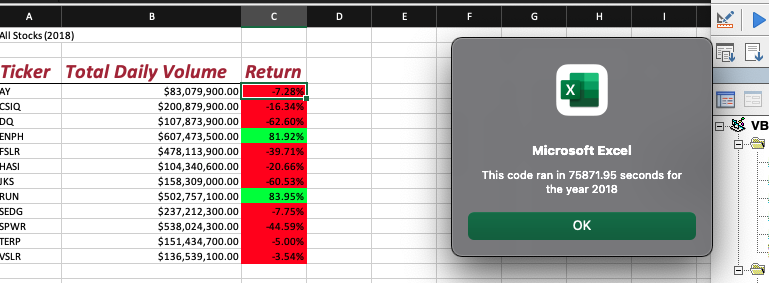
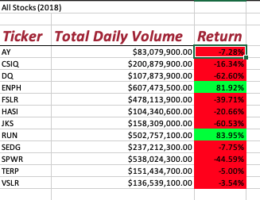

# stock-analysis
# Overview of Project

Previously, I prepared an Excel workbook for Steve to analyze his 12 green energy stocks performances. The workbook parse through two spreadsheet that including stock datas in year 2017 and 2018, and out put the data array in just a click of button to help him and his parents analyze all the stock performances.

## Purpose

The purpose of this project was to make a more efficient way to analyze the entire data set and collect the same information that previous workbook did. In order to do that, I need to refactor my code successfully and find a way to make the VBA script run faster. 

## Results

In the original code, we created a ticker output array .The ticker(i) will loop through all the row that is over 3000 rows each time, just to find the current row ticker matches our stock.  After that it will repeat to loop through al the 3000 rows to find the second stock that matches next. The process will loop through 12 times of our entire stock rows. So we can see there are some inefficient process there, excess repetitive searching for the rest of datas that we don't need . we can find a way to elimite the searching process, by improve the steps that only need to loop through our entire stock once to reduce the Macro run time. 
Here comes the fix:
```
1. Create Output Array(same 1st step as original)

2.Initialize variables. Create a variable tickerIndex for the ticker array and matches with the other 3 arrays: tickerVolumes, tickerStartingPrices, tickerEndingPrices.

    '1a) Create a ticker Index
    Dim tickerIndex As Single
         tickerIndex = 0
    '1b) Create three output arrays
    Dim tickerVolumes(12) As Long
    Dim tickerStartingPrices(12) As Single
    Dim tickerEndingPrices(12) As Single
    
    
    
    '2a) Create a for loop to initialize the tickerVolumes to zero.
      For i = 0 To 11
      
        tickerVolumes(i) = 0
        
        
    Next i
        
 
    '2b) Loop over all the rows in the spreadsheet.
     For i = 2 To RowCount

     
    '3a) Increase volume for current ticker
         
         
         tickerVolumes(tickerIndex) = tickerVolumes(tickerIndex) + Cells(i, 8).Value
      
        
        
    '3b) Check if the current row is the first row with the selected tickerIndex.
        'If  Then
            
            If Cells(i - 1, 1).Value <> tickers(tickerIndex) And Cells(i, 1).Value = tickers(tickerIndex) Then
            
            tickerStartingPrices(tickerIndex) = Cells(i, 6).Value
            End If
            
        'End If
        
    '3c) check if the current row is the last row with the selected ticker
         'If the next row’s ticker doesn’t match, increase the tickerIndex.
        'If  Then
            
            If Cells(i + 1, 1).Value <> tickers(tickerIndex) And Cells(i, 1).Value = tickers(tickerIndex) Then
            
            tickerEndingPrices(tickerIndex) = Cells(i, 6).Value
            
            

    '3d Increase the tickerIndex. To repeat the steps of 3a,3b,3c untill the end of the last ticker.
           
            tickerIndex = tickerIndex + 1
            End If
            
            
        'End If
    
    Next i
    
    '4) Loop through your arrays to output the Ticker, Total Daily Volume, and Return.
    For i = 0 To 11
        
        Worksheets("All Stocks Analysis").Activate
        
        Cells(4 + i, 1).Value = tickers(i)
        Cells(4 + i, 2).Value = tickerVolumes(i)
        Cells(4 + i, 3).Value = tickerEndingPrices(i) / tickerStartingPrices(i) - 1

 3. Formatting (same as original)       
```


### Run time analysis
Here are the run time comparison shown below.

2017 original vs 2017 refactored




2018 original vs 2018 refactored



After refactoring, you can see our run time for 2017 and our changed drastically. 


### Data results 





After we refactored the data, we got the same value as the original one. We can see clearly in 2017 almost all green stocks had  good results. Except 'TERP' with a negative return rate . The two most high returned rate stocks are 'DQ' and SEDG. The most traded with the higher total daily volumes stocks are "SPWR" and "FSLR". Other stocks such as 'CSIQ','ENPH','JKS','RUN' and 'SEDG' also had good market popularity with total daily volumes around 200 million.
In 2018, the data showed drastic changes. There are only stock 'ENPH' and 'RUN' provided positive return rate with the highest daily earnings volume.The 'ENPH' total daily volume increased from 200 million to 600 million, and  the stock 'RUN' increased from 200 million to 500 million respectively.
Based on the date we have seen from year 2017 to 2018, stock 'ENPH' and 'RUN' is the good stock for Steve and his parents to invest in.


## Summary

### Pros and Cons of refactoring code

Potentially refactoring code will improve code readability and reduce comlexity and be more efficient by taking fewer steps, using less memory. 
However, we may not have the luxury to refactoring code all the time due to its disadvantage. Code refactoring is time consuming especially when comes to big project that require major changes on both front and back end. If time is limited before releasing date, there will have a higher chance of failure due to code malfunction, lack of testing  and might cause to introduce bugs.


### Pros and Cons of refactored VBA script 
The major advantage of refactoring code in VBA script is we were able to revisit our code with new ideas and improve efficiency by decrease a significant Macro run time. Therefore, Steve and his parents would surely happy about that. Especially, in the future if they plan to have more stock to be analyzed.
The major disadvantage of refactoring code in VBA script is that it is time consuming. It takes time to understand the syntax and logic if we are new to VBA refactoring. It outweighs the time saved by our client, who doesn't have large date at current, where our originally code already served its purpose.